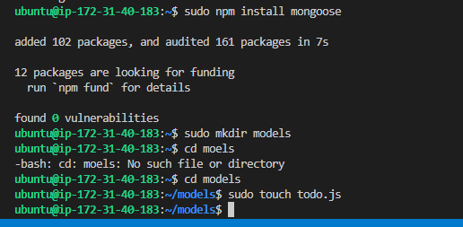

## MERN WEB STACK TO-DO APPLICATION

My server was updated using the command sudo apt update before I started working, and when the server had been updated, it was upgraded using the command sudo apt upgrade.

##  Getting Ubuntu's Node.js location 

Curl -fusSL https://deb.nodesource.com/setup 18.x | sudo -E bash is the command I use to acquire the location of NOde.js software from Ubuntu repositories, and the result it produces is displayed in the screenshot below:

I then used the command sudo apt-get install -y nodejs on the Ubuntu server to complete the installation of Node.js. Additionally, in addition to installing node.js, the script also installed npm, a package management for Node similar to apt in Ubuntu. Conflicts caused by dependencies are also managed using it. The results of the installation are seen in the image below.

In order to verify node installation, I run the commands node -v, sudo node -v, npm -v, or sudo npm -v. The results are shown in the image below:

## Application Code Setup

To start this, I created a directory for Todo project by runnning command sudo mkdir Todo and I confirmed the creation of the Todo directory by running command ls and ls -lih and the details is shown in the image below:

I used the command npm init to initialize the project after verifying the directory and entering the Todo directory so that a new file called package.json could be produced. As a result, the file includes details about the program as well as the dependencies required for its operation. For the output, see the image below.

To confirm that package,json file created ls command was excecuted.

## INSTALLING EXPRESSJS

To install expressjs, I type  sudo npm install express, and the output is shown in the image below.To install expressjs, I type sudo npm install express, and the output is shown in the image below.

I then used the touch index.js command to create it, and I run the ls command to make sure it had been created. The results are displayed below:

The command npm install dotenv is what I used to install the dotenv module. It produced the output shown below..

So I opened my browser and entered http://public-address:5000 to see if my configuration was successful after editing my EC2 security group to enable port 5000. and the following output was shown

## ROUTES 

The following three tasks should be carried out by the to-do application:

1. to create a new task;
2. to display list of all tasks; and 
3. to delete completed tasks

Each task will therefore be connected to a specific endpoint and use one of the three common HTTP request methods: POST, GET, or DELETE. For each task, routes defining the multiple endpoints the To-Do app will rely on will also be defined. Consequently, I used the command 'mkdir routes' to create a folder for routes.

I established a directory for routes and then used the command touch api.js to create a file inside of it with that name. I then opened the file with the vim api.js command and entered the following code into its output.

const express = require ('express');
const router = express.Router();

router.get('/todos', (req, res, next) => {

});

router.post('/todos', (req, res, next) => {

});

router.delete('/todos/:id', (req, res, next) => {

})

module.exports = router;

## MODELS

Given that the To-Do app will use Mongodb, a NoSQL database, I constructed a model for it. The software will become interactive thanks to the model that will be made.

In order to specify the fields stored in each Mongdb document, the model will also be utilized to define database schema (which describes the logical configuration of all or part of a relational database). How the database is built will be determined by the database schema.

I initially set up mongoose, a Node.js tool that simplifies interacting with mongodb, in order to generate the Schema and a model. So I used the command sudo npm install mongoose to install it.

