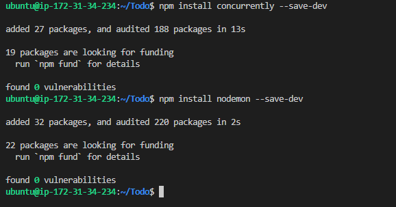

## MERN WEB STACK TO-DO APPLICATION

My server was updated using the command sudo apt update before I started working, and when the server had been updated, it was upgraded using the command sudo apt upgrade.

##  Getting Ubuntu's Node.js location 

Curl -fusSL https://deb.nodesource.com/setup 18.x | sudo -E bash is the command I use to acquire the location of NOde.js software from Ubuntu repositories, and the result it produces is displayed in the screenshot below:

I then used the command sudo apt-get install -y nodejs on the Ubuntu server to complete the installation of Node.js. Additionally, in addition to installing node.js, the script also installed npm, a package management for Node similar to apt in Ubuntu. Conflicts caused by dependencies are also managed using it. The results of the installation are seen in the image below.

In order to verify node installation, I run the commands node -v, sudo node -v, npm -v, or sudo npm -v. The results are shown in the image below:

## Application Code Setup

To start this, I created a directory for Todo project by runnning command sudo mkdir Todo and I confirmed the creation of the Todo directory by running command ls and ls -lih and the details is shown in the image below:

I used the command npm init to initialize the project after verifying the directory and entering the Todo directory so that a new file called package.json could be produced. As a result, the file includes details about the program as well as the dependencies required for its operation. For the output, see the image below.

To confirm that package,json file created ls command was excecuted.

## INSTALLING EXPRESSJS

To install expressjs, I type  sudo npm install express, and the output is shown in the image below.To install expressjs, I type sudo npm install express, and the output is shown in the image below.

I then used the touch index.js command to create it, and I run the ls command to make sure it had been created. The results are displayed below:

The command npm install dotenv is what I used to install the dotenv module. It produced the output shown below..

So I opened my browser and entered http://public-address:5000 to see if my configuration was successful after editing my EC2 security group to enable port 5000. and the following output was shown

## ROUTES 

The following three tasks should be carried out by the to-do application:

1. to create a new task;
2. to display list of all tasks; and 
3. to delete completed tasks

Each task will therefore be connected to a specific endpoint and use one of the three common HTTP request methods: POST, GET, or DELETE. For each task, routes defining the multiple endpoints the To-Do app will rely on will also be defined. Consequently, I used the command 'mkdir routes' to create a folder for routes.

I established a directory for routes and then used the command touch api.js to create a file inside of it with that name. I then opened the file with the vim api.js command and entered the following code into its output.

const express = require ('express');
const router = express.Router();

router.get('/todos', (req, res, next) => {

});

router.post('/todos', (req, res, next) => {

});

router.delete('/todos/:id', (req, res, next) => {

})

module.exports = router;

## MODELS

Given that the To-Do app will use Mongodb, a NoSQL database, I constructed a model for it. The software will become interactive thanks to the model that will be made.

In order to specify the fields stored in each Mongdb document, the model will also be utilized to define database schema (which describes the logical configuration of all or part of a relational database). How the database is built will be determined by the database schema.

I initially set up mongoose, a Node.js tool that simplifies interacting with mongodb, in order to generate the Schema and a model. So I used the command sudo npm install mongoose to install it.

Following this, I used the command sudo mkdir models to create a new directory for models and the command cd models to navigate to the directory. Using the command sudo touch todo.js, I then created a file inside the directory.

I made the file, opened it in Vim with the command sudo vim todo.js, entered the script below, and then saved it.

const mongoose = require('mongoose');
const Schema = mongoose.Schema;

//create schema for todo
const TodoSchema = new Schema({
action: {
type: String,
required: [true, 'The todo text field is required']
}
})

//create model for todo
const Todo = mongoose.model('todo', TodoSchema);

module.exports = Todo;

After doing this, I changed directory into the routes directory, opened the api.js file with the command sudo vim, removed the text there with the command:%d, inserted the script below into it, and then saved it.

const express = require ('express');
const router = express.Router();
const Todo = require('../models/todo');

router.get('/todos', (req, res, next) => {

//this will return all the data, exposing only the id and action field to the client
Todo.find({}, 'action')
.then(data => res.json(data))
.catch(next)
});

router.post('/todos', (req, res, next) => {
if(req.body.action){
Todo.create(req.body)
.then(data => res.json(data))
.catch(next)
}else {
res.json({
error: "The input field is empty"
})
}
});

router.delete('/todos/:id', (req, res, next) => {
Todo.findOneAndDelete({"_id": req.params.id})
.then(data => res.json(data))
.catch(next)
})

module.exports = router;

## MONGODB DATABASE

I built a database on the mLab platform, which MongoDB provides, to house all of my data. So, in the mLab, I made a new cluster called sam. 

I specified process.env in the index.js file, but it had not yet been created. So I went into my Todo directory and created a file called.env by running command touch.env, then I vi into the file and typed the code DB ='mongodb+srv:/sammyjel:password>@cluster0.n4kgzvy.mongodb.net/?retryWrites=true&w=majority' that I got from the sammyjel database created on the mLab.

After that, I updated the contents of the index.js file. To accomplish this, I entered vim into the file, deleted the existing file with command:%d, and then typed the following code into it.

const express = require('express');
const bodyParser = require('body-parser');
const mongoose = require('mongoose');
const routes = require('./routes/api');
const path = require('path');
require('dotenv').config();

const app = express();

const port = process.env.PORT || 5000;

//connect to the database
mongoose.connect(process.env.DB, { useNewUrlParser: true, useUnifiedTopology: true })
.then(() => console.log(`Database connected successfully`))
.catch(err => console.log(err));

//since mongoose promise is depreciated, we overide it with node's promise
mongoose.Promise = global.Promise;

app.use((req, res, next) => {
res.header("Access-Control-Allow-Origin", "\*");
res.header("Access-Control-Allow-Headers", "Origin, X-Requested-With, Content-Type, Accept");
next();
});

app.use(bodyParser.json());

app.use('/api', routes);

app.use((err, req, res, next) => {
console.log(err);
next();
});

app.listen(port, () => {
console.log(`Server running on port ${port}`)
});

I then launched my server by typing node index.js into the command line, and the output indicating a successful database connection is seen in the image below. as displayed on the output display in the following image:

*Testing Backend Code without Frontend using RESTful API*

After creating the backend of the program and configuring the database, I have not yet constructed the front end user interface. As a result, I used ReactJS to implement it, and I tested the code using an API development client. Therefore, I used Postman to test the code. The results of the Post request and Get request I did using the Postman application are displayed in the images below. As a result, this shows that the backend component is supporting:

1. the HTTP GET request's presentation of a task list
2. add a new task, such as an HTTP POST request, to the list
3. HTTP DELETE request is used to remove an existing task from the list.

## FRONTEND CREATION (CONTINUED)

I developed a user interface for a Web client (browser) so it can communicate with the program through the API once I had all the functionality I needed from the backend and the API. I used the command npx create-react-app client to accomplish this, and the results are shown in the images below:

## Running A Reacting App

Following the installation of the reacting app, I also installed Nodemon and concurrently with the commands npm install concurrently —save-dev and npm install nodemon —save-dev, and the results were seen below, accordingly.

Open the package.json file in the todo directory using the vim command, then change the script as follows:

"scripts": {
    "test": "echo \"Error: no test specified\" && exit 1"
}

with

"scripts": {
"start": "node index.js",
"start-watch": "nodemon index.js",
"dev": "concurrently \"npm run start-watch\" \"cd client && npm start\""
},

Instead of including the entire path, such as http://localhost:5000/api/todos, I opened the package.json file in the client directory with vi package.json and added the key value pair "proxy": "http://localhost:5000", ensuring that the application can be accessed on the browser with a url like http://localhost:5000.

After that, I cd back into the Todo directory and type npm run dev. The output was displayed in the image below below.

*Creating React Components*

I opened the client directory, went to the src directory, created the react components folder using the command mkdir components, and then created three separate files using the touch command, including input.js, listtodo.js, and todo.js.

Consequently, I used the command vi Input.js to open the file, type the following script, and save it:

import React from 'react';

const ListTodo = ({ todos, deleteTodo }) => {

return (
<ul>
{
todos &&
todos.length > 0 ?
(
todos.map(todo => {
return (
<li key={todo._id} onClick={() => deleteTodo(todo._id)}>{todo.action}</li>
)
})
)
:
(
<li>No todo(s) left</li>
)
}
</ul>
)
}

export default ListTodo

After that, I opened the Todo.js file and added the following script before saving it.

import React, {Component} from 'react';
import axios from 'axios';

import Input from './Input';
import ListTodo from './ListTodo';

class Todo extends Component {

state = {
todos: []
}

componentDidMount(){
this.getTodos();
}

getTodos = () => {
axios.get('/api/todos')
.then(res => {
if(res.data){
this.setState({
todos: res.data
})
}
})
.catch(err => console.log(err))
}

deleteTodo = (id) => {

    axios.delete(`/api/todos/${id}`)
      .then(res => {
        if(res.data){
          this.getTodos()
        }
      })
      .catch(err => console.log(err))

}

render() {
let { todos } = this.state;

    return(
      

        <h1>My Todo(s)</h1>
        <Input getTodos={this.getTodos}/>
        <ListTodo todos={todos} deleteTodo={this.deleteTodo}/>
      

    )

}
}

export default Todo;

I then used the command vi App.css to access the file and added the following script.

.App {
text-align: center;
font-size: calc(10px + 2vmin);
width: 60%;
margin-left: auto;
margin-right: auto;
}

input {
height: 40px;
width: 50%;
border: none;
border-bottom: 2px #101113 solid;
background: none;
font-size: 1.5rem;
color: #787a80;
}

input:focus {
outline: none;
}

button {
width: 25%;
height: 45px;
border: none;
margin-left: 10px;
font-size: 25px;
background: #101113;
border-radius: 5px;
color: #787a80;
cursor: pointer;
}

button:focus {
outline: none;
}

ul {
list-style: none;
text-align: left;
padding: 15px;
background: #171a1f;
border-radius: 5px;
}

li {
padding: 15px;
font-size: 1.5rem;
margin-bottom: 15px;
background: #282c34;
border-radius: 5px;
overflow-wrap: break-word;
cursor: pointer;
}

@media only screen and (min-width: 300px) {
.App {
width: 80%;
}

input {
width: 100%
}

button {
width: 100%;
margin-top: 15px;
margin-left: 0;
}
}

@media only screen and (min-width: 640px) {
.App {
width: 60%;
}

input {
width: 50%;
}

button {
width: 30%;
margin-left: 10px;
margin-top: 0;
}
}

In addition, I opened index.css file with command vi index.css and wrote the script below into it

body {
margin: 0;
padding: 0;
font-family: -apple-system, BlinkMacSystemFont, "Segoe UI", "Roboto", "Oxygen",
"Ubuntu", "Cantarell", "Fira Sans", "Droid Sans", "Helvetica Neue",
sans-serif;
-webkit-font-smoothing: antialiased;
-moz-osx-font-smoothing: grayscale;
box-sizing: border-box;
background-color: #282c34;
color: #787a80;
}

code {
font-family: source-code-pro, Menlo, Monaco, Consolas, "Courier New",
monospace;
}

The result shown in the following photos was generated after I went back to the Todo directory and ran the command npm run dev.

